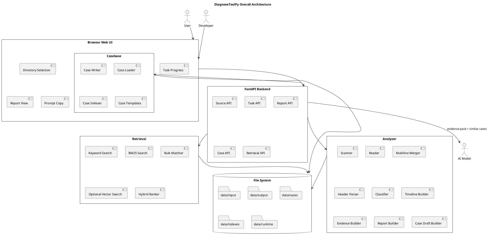

# DiagnoseToolPy Design

## Overview

DiagnoseToolPy is a lightweight Web-based diagnostic assistant for operational stability.

It supports:

- server-side log directory scanning
- large-log streaming analysis
- multiline stack trace merge
- complex log header parsing
- rule-based exception classification
- evidence package generation
- case draft generation
- manual case creation
- file-based case knowledge base
- retrieval without mandatory embeddings
- optional vector search

## Architecture Principle

```text
File documents are the source of truth.
Indexes are rebuildable caches.
AI diagnosis is assistive.
Human confirmation is required for final root cause.
```

## Overall Architecture



## Main Flow

```text
server log directory
→ scan
→ stream read
→ merge multiline events
→ parse headers
→ classify exceptions
→ generate timeline
→ sample key logs
→ generate evidence-pack
→ retrieve similar cases
→ build AI prompt
→ archive as case
```

## Key Output Files

Analysis task:

```text
data/output/{task_id}/
├── task.yaml
├── progress.json
├── summary.html
├── evidence-pack.md
├── key-logs.txt
├── case-draft.md
├── case-metadata-draft.yaml
├── retrieval-query.json
└── artifacts/
```

Archived case:

```text
data/cases/{case_id}_{slug}/
├── case.md
├── metadata.yaml
├── evidence-pack.md
├── key-logs.txt
├── ai-diagnosis.md
├── review.md
├── actions.md
└── artifacts/
```

## Memory Behavior

Large files must be processed by streaming reads.

Forbidden:

```python
content = file.read()
```

Required:

```python
for line in file:
    process(line)
```

Samples must be bounded.

## Security Boundary

The backend may only scan directories under configured input roots.

Invalid or unauthorized paths must be rejected before scanning.
