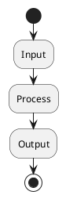

# Design: {change_name}

## 1. Overview

## 2. Data Flow

## 3. Module Responsibilities

## 4. File Outputs

## 5. Error Handling

## 6. Security Considerations

## 7. Memory Behavior

## 8. Tests

## 9. Compatibility

## 10. Open Questions
